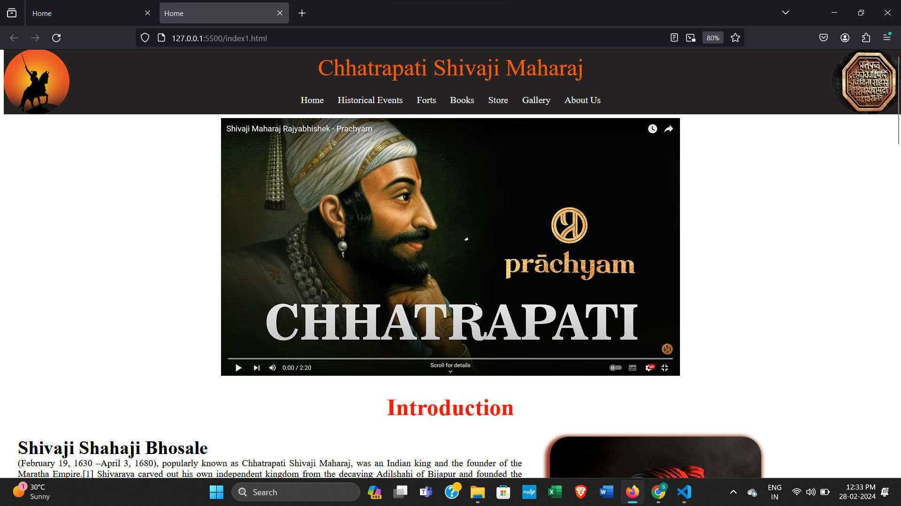

# Chhtrapati Shivaji Maharaj🚩

Welcome to our website , Explore Chhtrapati Shivaji Maharaj brave stroy .

Shri Chatrapati Shivaji Maharaj (Circa 1630-1680) was a legendary leader and ruler who was much ahead of his time. A visionary who changed the course of Indian history by challenging foreigners' domination by creating a vibrant martial society out of a subjugated impoverished population.

We include Historical Event in Ch.Shivaji Maharaj .This event give us a Very Proud feeling on Ch.Shivaji Maharaj . In this page also include Fort that gain by shivaji maharaj and theri team member called as "Mavale".

 

 ## How to contribute 

 1. Step 1: Sign into GitHub
   
   Sign into your GitHub account, or create a free GitHub account if you don't have one

2. Step 2: Fork the project repository

 Find the project's repository on GitHub, and then "fork" it by clicking the Fork button in the upper right corner:

 3. Step 3: Clone your fork

While still in your repository, click the green Clone or download button and then copy the HTTPS 

4. Step 4: Navigate to your local repository

Since the clone was downloaded into a subdirectory of your working directory, you can navigate to it using: cd NAME_OF_REPOSITORY.

5. Step 5: Check that your fork is the "origin" remote

6. Step 6: Add the project repository as the "upstream" remote

Go to your fork on GitHub, and click the "forked from" link to return to the project repository:

